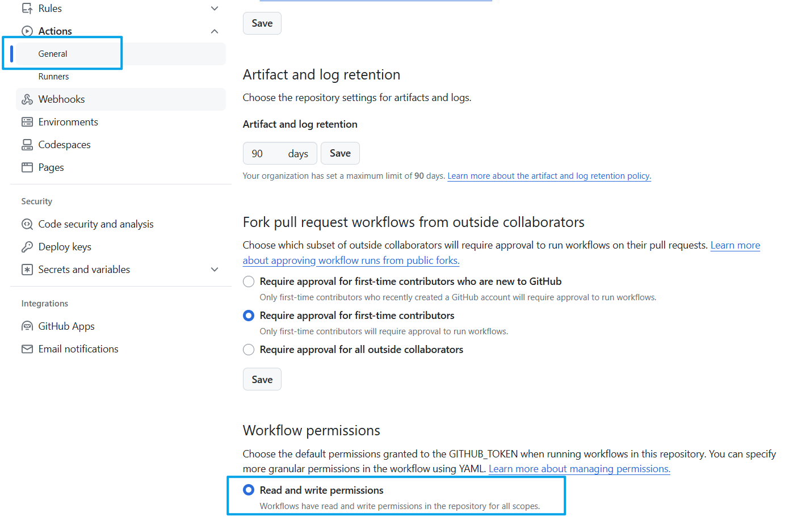

# Introduction
This action supports `pull_request` event, after obtaining the PR body and removing Markdown comments, 
automatically updates the PR body via the GitHub bot.

## Inputs
- `token`
The GitHub token to use

## Outputs

### `PR body`
The PR body whose comments are removed

# Example usage
`.github/workflows/xxx.yml`
```yaml
on:
    pull_request:
jobs:
    remove_pr_markdown_comments:
        runs-on: ubuntu-latest
        steps:
            - name: Checkout
              uses: actions/checkout@v4
            - name: Remove PR Markdown Comments
              uses: urlyy/remove_PR_markdown_comments@v1.0
              with:
                  token: ${{ secrets.GITHUB_TOKEN }}
```

# Notice
As this action uses `secrets.GITHUB_TOKEN`, we need to turn the switch of your repository on, or we will get the following log:`Error: Resource not accessible by integration - https://docs.github.com/rest/pulls/pulls#update-a-pull-request`


# A simple javascript demo
```javascript
const text = `<!--
**xxxxxxxxx.**

-->

## What does this PR do?

<!-- xxxxxxxxx -->


## Related issues

<!--
Is there any related issue? Please attach here.

- #xxxx0
- #xxxx1
- #xxxx2
-->


## Does this PR introduce any user-facing change?

<!--
xxxxxxxxxx
xxxxxxxxxx
xxxxxxxxxx-->

- [ ] Does this PR introduce any public API change?
- [ ] Does this PR introduce any binary protocol compatibility change?


## Benchmark

<!--
xxxxxxxxx
-->
`

function removeMarkdownComments(markdownText = "") {
    // regex for comments in Markdown (<!-- comment -->）
    const commentPattern = /<!--[\s\S]*?-->[\r\n]*/g;
    // use regex.replace method remove all matched comments
    const cleanedText = markdownText.replace(commentPattern, '');
    return cleanedText;
}

const res = removeMarkdownComments(text);
console.log(res);
```
